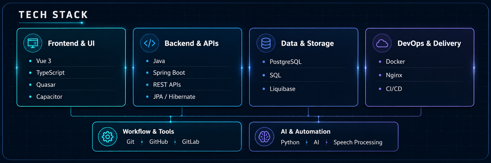

# Idris Özcan

**Software Developer · Backend, Cloud & Product Engineering**

Building backend systems, modern web applications, and independent software products.

  

## About

I'm a software developer focused on backend engineering, APIs, software architecture, and increasingly cloud-native
infrastructure.

Currently completing my software development apprenticeship in Germany while building and shipping independent software
products and participating in technical challenges and hackathons.

I enjoy taking ideas from architecture and implementation all the way to deployment.

## Technology

**Backend** — Java · Spring Boot · REST APIs · JPA / Hibernate · Maven  
**Frontend** — Vue 3 · TypeScript · Quasar · JavaScript · Capacitor  
**Data** — PostgreSQL · SQL · Liquibase  
**Platform & Delivery** — Docker · Nginx · CI/CD · Kubernetes *(learning)*  
**Tools** — Git · GitHub · GitLab  
**Applied AI** — Python · FastAPI · AI APIs · Speech Processing

## Featured Projects

### [KadriX](https://github.com/KaidoOP/KadriX)

**IBM Bob Dev Day Hackathon Project**

AI-assisted launch workflow that transforms product briefs and demo footage into structured launch assets and generated
preview videos.

`Vue 3` `TypeScript` `Python` `FastAPI` `Docker`

→ Microservice-oriented backend behind an API gateway  
→ Automated video-processing workflow  
→ IBM watsonx.ai and Watson Text-to-Speech integrations  
→ Containerized services with Docker

---

### QiblaSoul

**Independent Product · Built End to End**

Multilingual software platform combining AI, speech processing, mobile functionality, real-time services, and
subscription features.

`Java` `Spring Boot` `Vue 3` `Capacitor` `PostgreSQL`

→ Backend APIs and mobile frontend  
→ Authentication, notifications, localization, and subscriptions  
→ AI and speech-processing integrations  
→ REST and real-time service communication  
→ Deployment and CI/CD workflows

`Idea → Architecture → Backend → Frontend → Mobile → Deployment`

---

### Mesh

**Software Engineering Orchestration Platform · Work in Progress**

Platform for coordinating software projects, requirements, tasks, repositories, technical decisions, and AI-assisted
development workflows.

`Java 21` `Spring Boot` `React` `TypeScript` `PostgreSQL`

→ Durable project, task, and run orchestration  
→ Isolated Git workspaces  
→ Parallel execution workflows  
→ AI-assisted software engineering workflows

## Currently

→ Deepening my knowledge of Kubernetes and cloud-native infrastructure  
→ Building independent software products  
→ Improving CI/CD and reliable deployment workflows  
→ Learning more about distributed systems and platform engineering  
→ Building useful tools for developers and end users

## Interests

`Backend Engineering` · `Cloud` · `DevOps` · `Distributed Systems` · `AI` · `Hackathons` · `Developer Tools`

## Connect

I'm interested in software engineering, cloud infrastructure, hackathons, open-source projects, and building useful
products.

**Email:** [idris.oezcan@outlook.com](mailto:idris.oezcan@outlook.com)