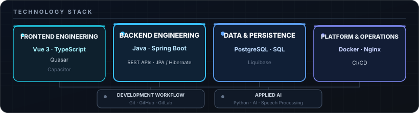

# Idris Özcan

**Software Developer · Independent Builder**

Building backend systems, modern web applications, and digital products.

## About

I build enterprise applications and independent software products, mainly around backend systems, APIs, and software architecture.

Currently completing vocational training in application development in Germany while independently building and shipping software and web products.

## Technology

  
  
  
  
  
  
  
  

**Backend** — Java · Spring Boot · REST APIs · JPA / Hibernate · Maven 
**Frontend** — Vue 3 · Quasar · TypeScript · JavaScript · Capacitor 
**Data** — PostgreSQL · SQL · Liquibase 
**Infrastructure** — Docker · Nginx 
**Engineering** — Git · GitHub · GitLab · CI/CD

## Featured Projects

### [KadriX](https://github.com/KaidoOP/KadriX)

**IBM Bob Dev Day Hackathon project**

AI-assisted launch workflow turning product briefs and demo footage into structured launch assets and generated preview videos.

`Vue 3` `TypeScript` `Python` `FastAPI` `Docker`

→ Microservice-oriented backend behind an API gateway 
→ Video processing with optional IBM watsonx.ai and Watson TTS integrations

### QiblaSoul

**Private mobile product · built end to end**

Multilingual mobile platform combining AI, speech processing, real-time services, and subscription functionality.

`Java` `Spring Boot` `Vue 3` `Capacitor` `PostgreSQL`

→ Backend, mobile frontend, authentication, notifications, localization, subscriptions, and deployment 
→ AI and speech processing with REST and real-time service integration

> `Idea` → `Architecture` → `Backend` → `Frontend` → `Mobile` → `Deployment`

### Mesh

**Software engineering orchestration platform**

Coordinates software projects, requirements, tasks, repositories, decisions, and AI-assisted development workflows.

`Java 21` `Spring Boot` `React` `TypeScript` `PostgreSQL`

→ Durable task, run, and project orchestration 
→ Isolated Git workspaces and parallel execution workflows

## Hackathons & Building

I enjoy turning ideas into working prototypes under real constraints and participating in hackathons and technical challenges.

`IBM Bob Dev Day Hackathon` · `More projects coming`

## Currently

→ Building independent software products 
→ Deepening backend architecture and automation 
→ Improving CI/CD and reliable deployment workflows

## Let's connect

Software · Web · Hackathons · Interesting technical projects

[idris.oezcan@outlook.com](mailto:idris.oezcan@outlook.com)
